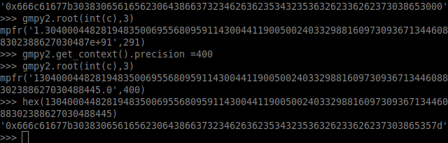

# Description
`So much of crypto is all about shapes! Since some shapes have so many special sides :)`

# Analysis
A shape with 6 faces like a square.
```
n=0x9ffa2a58ad286990fc5fe97b669e8cb2752e81fafa5ac774ea856d8ca124089ba4b06fe21a5d588c1dcb9602838d32cd70e50b85dec21fa79944543176c7a3b8b804ab754af2978f23b09f2905103dd5a4c748df8d9e9a079a5b38f6f69051b3c6582ebc2d2d199b3a97cb7e58af79b90fe08884626d188e194816bd51960a45
e = 0x3 
c=0x10652cdfaa6a6f6f688b98219cd32ce42c4d4df94afaea31cd94dfac50678b1f50f3ab1fd389f9998b6727ffd1a2c06ee6bde21ae85daef63fd0fa694a93f3674dc3f9ea0f2e3283a3d9897137aea12458aa3b8f96c61f3bf74a510bab7e7d8b7af52290d2621f1e06e52e6a7be4896c6465

```
My initial thought when reading the provided text file is that e is an exponent, c is cipher text and n is the modulus for  RSA due to convention. I attempted to [factor](https://www.alpertron.com.ar/ECM.HTM) the modulus but decided it was not fruitful as a teammate sent an article explaining the attack. The  [attack](https://www.johndcook.com/blog/2019/03/06/rsa-exponent-3/) essentially utilizes the tiny exponent used which allows the attacker to take the cube root of the encrypted message. [gmpy2](https://gmpy2.readthedocs.io/en/latest/overview.html) was used to avoid any rounding issues. I then used cyber-chef to convert the hex string to the corresponding ASCII string.

flag{080eaeb0d8f724bcb542562b3bb708e5}



